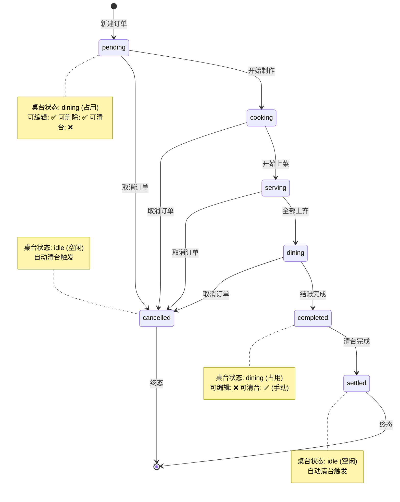
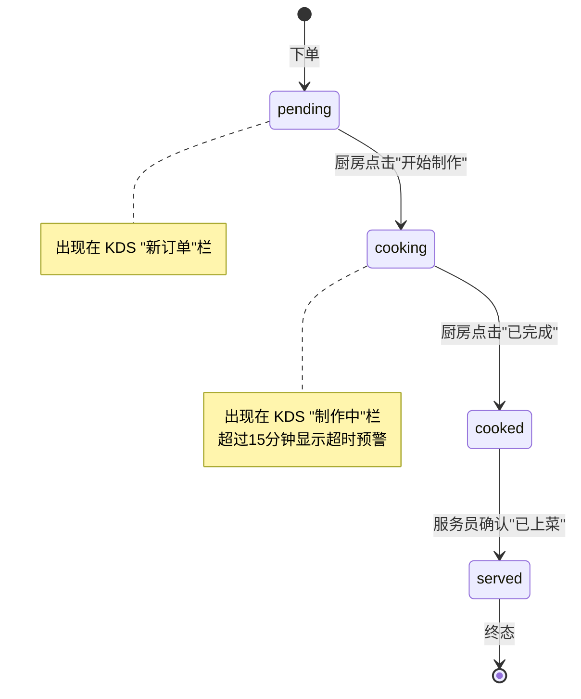
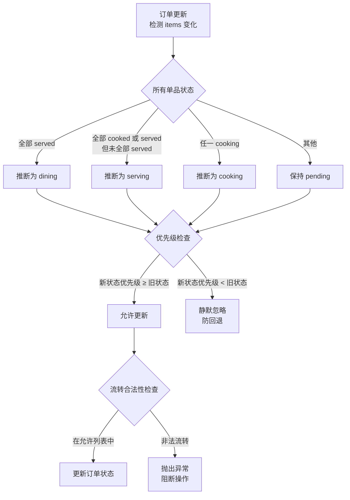
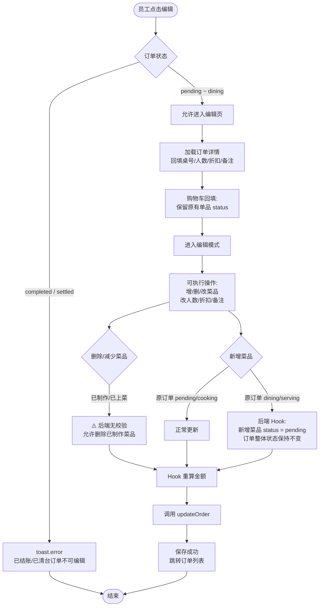
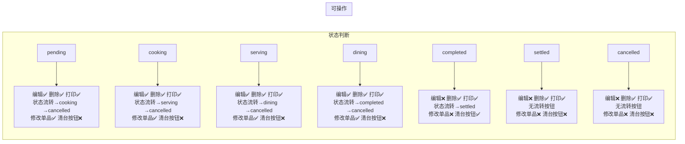
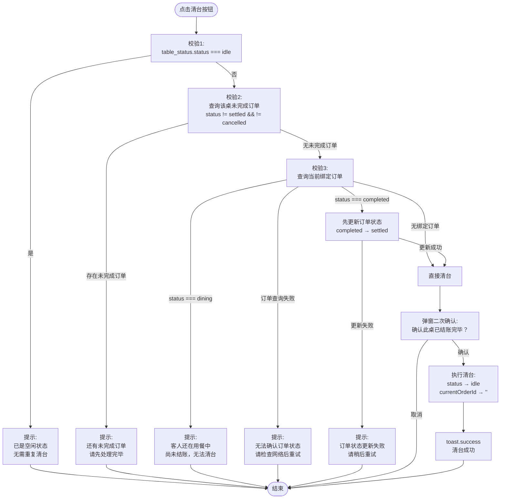
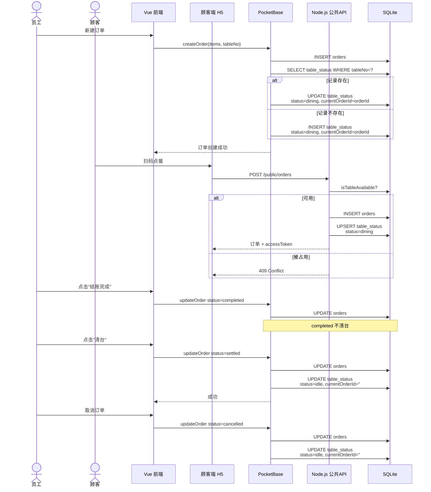
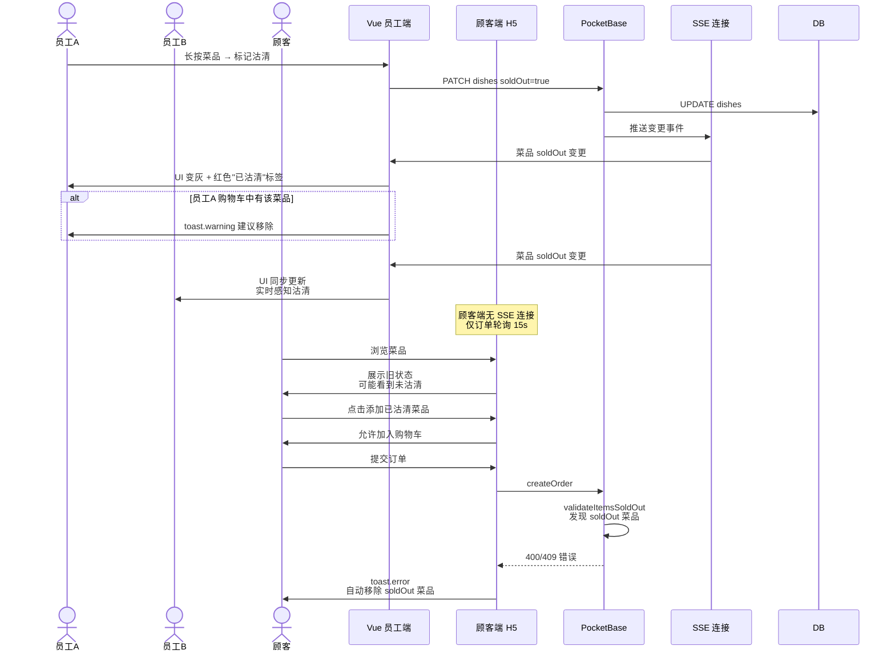
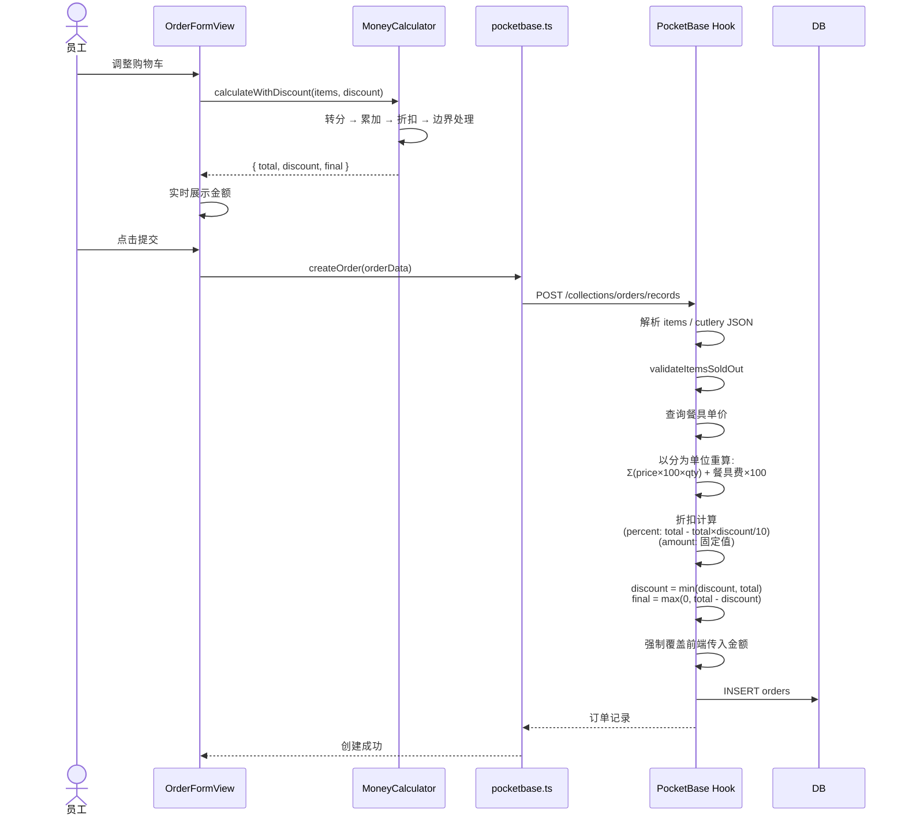

# 智能点菜系统 - 业务流程全景图

> **文档用途**: 全面梳理实际用餐业务场景中的核心流程，消除业务逻辑处理混乱  
> **目标读者**: 架构师、开发工程师、测试工程师、产品经理  
> **更新日期**: 2026-04-21  
> **版本**: v1.0

---

## 阅读指南

本文档使用 **Mermaid** 语法绘制流程图，支持在以下工具中渲染：
- GitHub / GitLab Markdown 预览
- VS Code + Markdown Preview Mermaid Support 插件
- 在线编辑器: https://mermaid.live

---

## 1. 订单状态机总图

### 1.1 订单整体状态（Order Status）



### 1.2 菜品单品状态（Item Status）



### 1.3 订单状态自动推断规则



---

## 2. 员工端核心业务流程

### 2.1 新建订单完整流程

```mermaid
flowchart TD
    Start([员工打开<br/>新建订单页]) --> Load[加载系统设置<br/>加载全部菜品]
    Load --> Init[初始化:<br/>guests=4, cutleryQty=4<br/>购物车为空]
    Init --> SSE[建立 SSE 连接<br/>实时同步菜品沽清]

    SSE --> SelectTable[选择桌号]
    SelectTable --> SelectGuests[选择用餐人数]
    SelectGuests --> Browse[浏览菜品分类]

    Browse --> AddDish{添加菜品}
    AddDish -->|铁锅鱼/铁锅炖鱼| AutoPot{锅底是否沽清}
    AutoPot -->|否| AddPot[自动加入锅底 1份]
    AutoPot -->|是| WarnPot[toast.warning<br/>锅底沽清无法自动添加]
    AddPot --> CartUpdate[更新购物车]
    WarnPot --> CartUpdate
    AddDish -->|普通菜品| CheckSoldOut{菜品沽清}
    CheckSoldOut -->|已沽清| BlockAdd[toast.warning<br/>拦截添加]
    CheckSoldOut -->|未沽清| CartUpdate
    BlockAdd --> Browse

    CartUpdate --> CartOp[购物车操作:<br/>±数量 / 改备注 / 删除]
    CartOp --> Discount[配置折扣:<br/>百分比(如8折) / 固定减免]
    Discount --> Cutlery[餐具配置:<br/>收费/免费, 数量默认=guests]

    CartOp --> Submit{点击提交}
    Discount --> Submit
    Cutlery --> Submit

    Submit --> PreCheck1[前置校验1:<br/>购物车沽清检查]
    PreCheck1 -->|含 soldOut| Err1[toast.error<br/>列出沽清菜品<br/>阻断提交]
    Err1 --> CartOp

    PreCheck1 -->|全部可售| PreCheck2[前置校验2:<br/>表单合法性<br/>桌号/人数/至少1道菜]
    PreCheck2 -->|不通过| Err2[toast.error<br/>阻断提交]
    Err2 --> CartOp

    PreCheck2 -->|通过| PreCheck3[前置校验3:<br/>桌台占用检查]
    PreCheck3 -->|status=dining<br/>且 currentOrderId 存在| Err3[toast.error<br/>桌台已被占用]
    Err3 --> SelectTable

    PreCheck3 -->|桌台可用| Build[构造订单数据:<br/>orderNo / status=pending<br/>items / cutlery / 金额]
    Build --> API1[API: createOrder]
    API1 --> Hook1[后端 Hook:<br/>1. 校验 soldOut<br/>2. 校验桌台占用<br/>3. 重算金额<br/>4. 自动开台]
    Hook1 -->|校验失败| Err4[返回 400/409<br/>toast.error]
    Err4 --> CartOp
    Hook1 -->|成功| Success1[创建成功]
    Success1 --> ClearCart[清空购物车]
    ClearCart --> Jump[跳转订单列表]
    Jump --> End1([结束])
```

### 2.2 编辑订单完整流程



### 2.3 订单详情页操作权限矩阵



### 2.4 手动清台完整流程



---

## 3. 顾客端业务流程

### 3.1 首次扫码点餐流程

```mermaid
flowchart TD
    CStart([顾客扫码<br/>带 tableNo 参数]) --> CCheck{tableNo 是否存在}
    CCheck -->|为空| CErr1[toast.error<br/>无效桌号]
    CErr1 --> CEnd([结束])

    CCheck -->|有效| CLoad[并行加载:<br/>菜品列表 + 桌台状态]
    CLoad --> CSession[检查 sessionStorage<br/> customer_order_id + token]
    CSession -->|有有效会话<br/>订单非终态| CRestore[恢复已有订单<br/>进入加菜模式]
    CSession -->|无会话或已结束| CDetect[检测桌台:<br/>ts.currentOrderId?]

    CDetect -->|存在未完成订单| CJoin[自动加入订单<br/>创建新会话<br/>进入加菜模式]
    CDetect -->|上一单已结束| CInfo[toast.info<br/>请开始新点餐]
    CDetect -->|无历史订单| CSetup[强制弹出人数选择<br/>默认 guests=1]

    CInfo --> CSetup
    CSetup --> CBrowse[浏览菜品分类<br/>排除"餐具"分类]

    CBrowse --> CAdd{添加菜品}
    CAdd -->|铁锅鱼| CAutoPot[自动加锅底<br/>⚠️ 不检查锅底沽清]
    CAutoPot --> CCart[加入购物车]
    CAdd -->|普通菜品| CCart

    CCart --> CViewCart[打开购物车面板]
    CViewCart --> CShow1[展示已下单菜品<br/>只读 + 状态标签]
    CShow1 --> CShow2[展示新加菜品<br/>可编辑数量/删除]
    CShow2 --> CRemark[整单口味偏好]
    CRemark --> CSubmit{点击提交}

    CSubmit --> CPreCheck[前置校验:<br/>cart 非空]
    CPreCheck -->|为空| CErr2[阻断]
    CErr2 --> CViewCart

    CPreCheck -->|非空| CSoldOut[检查 cart 中 soldOut 项]
    CSoldOut -->|存在 soldOut| CRemove[自动移除 soldOut 菜品<br/>toast.error 提示]
    CRemove --> CViewCart

    CSoldOut -->|全部可售| CCreate[调用 public API<br/>createOrder]
    CCreate --> CHook[后端处理:<br/>校验 soldOut<br/>重算金额<br/>自动开台]
    CHook -->|失败| CErr3[toast.error]
    CErr3 --> CViewCart
    CHook -->|成功| CToken[返回 accessToken]
    CToken --> CSave[持久化会话<br/>sessionStorage]
    CSave --> CSuccess[显示成功页<br/>2秒后关闭购物车]
    CSuccess --> CClear[clearCart]
    CClear --> CReload[reloadData]
    CReload --> CEnd
```

### 3.2 顾客端追加菜品流程

```mermaid
flowchart TD
    AStart([顾客扫码<br/>已有未完成订单]) --> ALoad[加载订单 + 菜品]
    ALoad --> ALock[人数锁定<br/>禁用修改]
    ALock --> AHint[底部提示:<br/>新菜品将追加到 xxx]

    AHint --> ABrowse[浏览菜品]
    ABrowse --> AAdd[添加菜品到购物车]
    AAdd --> AView[打开购物车面板]
    AView --> AShow1[已下单菜品<br/>"再来一份"按钮]
    AShow1 --> AAgain[点击再来一份<br/>quantity=1 加入新 cart]

    AView --> ASubmit{确认追加}
    ASubmit --> ASoldOut[检查 soldOut<br/>自动移除]
    ASoldOut -->|有移除| AReturn[返回购物车]
    AReturn --> AView
    ASoldOut -->|全部可售| ACall[调用 appendOrderItems]

    ACall --> AMerge[后端 mergeOrderItems:<br/>相同 dishId quantity 累加<br/>原状态非 pending 则重置为 pending]
    AMerge --> AOK[toast.success<br/>已追加]
    AOK --> AClose[2秒后关闭购物车]
    AClose --> AEnd([结束])
```

---

## 4. KDS 厨房端业务流程

### 4.1 厨房作业流程

```mermaid
flowchart TD
    KStart([打开厨房大屏]) --> KLoad[加载订单:<br/>排除 completed/settled/cancelled]
    KLoad --> KSSE[建立 SSE 连接<br/>失败则降级 10s 轮询]
    KSSE --> KSound[新 pending 菜品增加时<br/>播放"叮咚叮"提示音]

    KSound --> KView1[第一栏: 新订单<br/>按创建时间升序]
    KView1 --> KCard1[卡片内容:<br/>桌号(大号) / 顾客标签<br/>下单时间 / 仅 pending 菜品<br/>整单备注(红色高亮)]

    KCard1 --> KAction1[点击"开始制作"]
    KAction1 --> KUpdate1[API: updateOrderItemStatus<br/>pending → cooking]
    KUpdate1 --> KHook1[后端 Hook:<br/>推断订单状态 → cooking]
    KHook1 --> KRefresh1[卡片移至第二栏]

    KRefresh1 --> KView2[第二栏: 制作中<br/>显示已制作时长]
    KView2 --> KOver15{时长 > 15分钟}
    KOver15 -->|是| KWarn[橙色卡片<br/>边框闪烁 🔥]
    KOver15 -->|否| KNormal[正常显示]

    KNormal --> KAction2[点击"已完成"]
    KWarn --> KAction2
    KAction2 --> KUpdate2[API: updateOrderItemStatus<br/>cooking → cooked]
    KUpdate2 --> KHook2[后端 Hook:<br/>推断订单状态 → serving/dining]
    KHook2 --> KDisappear[该菜品从 KDS 消失<br/>等待服务员上菜]
    KDisappear --> KEnd([结束])
```

---

## 5. 跨端协同流程

### 5.1 桌台状态同步时序图



### 5.2 沽清多端同步时序图



### 5.3 金额计算双保险时序图



---

## 6. 后台管理流程

### 6.1 菜品维护与沽清管理

```mermaid
flowchart TD
    MStart([进入菜品维护]) --> MLoad[加载全部菜品]
    MLoad --> MDisplay[按分类展示<br/>热门菜品优先排序]

    MDisplay --> MCRUD[CRUD 操作]
    MCRUD --> MAdd[新增菜品:<br/>名称/分类/价格/描述]
    MCRUD --> MEdit[编辑菜品]
    MCRUD --> MDel[删除菜品]

    MDisplay --> MSoldOut[沽清管理]
    MSoldOut --> MLongPress[长按/右键菜品<br/>弹出 ActionSheet]
    MLongPress --> MMark[标记为已沽清<br/>可输入备注]
    MMark --> MOptimistic[前端乐观更新<br/>UI 立即变灰]
    MOptimistic --> MAPI[API: PATCH soldOut=true]
    MAPI -->|失败| MRollback[回滚 UI<br/>恢复 soldOut=false]
    MAPI -->|成功| MToast[toast.success<br/>10秒内可撤销]
    MToast --> MUndo[点击撤销]<br/>|超时| MKeep[保持沽清]
    MUndo --> MAPI2[PATCH soldOut=false]

    MSoldOut --> MBatch[批量管理抽屉]
    MBatch --> MSearch[搜索/分类筛选]
    MSearch --> MToggle[单个标记/恢复]
    MBatch --> MClearAll[一键清空所有沽清]

    MSoldOut --> MAuto[每日 04:00<br/>定时任务自动重置<br/>所有 soldOut=true]
```

---

## 7. 异常与边界流程

### 7.1 网络异常处理

```mermaid
flowchart TD
    NetStart[网络请求] --> NetCheck{网络状态}
    NetCheck -->|在线| NetNormal[正常请求]
    NetCheck -->|离线| NetQueue[PWA 请求队列<br/>Service Worker 缓存]
    NetQueue --> NetRetry[网络恢复后自动重试]

    NetNormal --> NetTimeout{超时?}
    NetTimeout -->|是(>10s)| NetErr1[toast.error<br/>网络超时，请稍后重试]
    NetTimeout -->|否| NetResp{响应状态}

    NetResp -->|400| NetErr2[toast.error<br/>参数错误 / 业务校验失败]
    NetResp -->|401| NetErr3[清除 Token<br/>跳转登录页]
    NetResp -->|403| NetErr4[toast.error<br/>权限不足]
    NetResp -->|404| NetErr5[toast.error<br/>资源不存在]
    NetResp -->|409| NetErr6[toast.error<br/>业务冲突<br/>如 soldOut 菜品提交]
    NetResp -->|408| NetErr7[toast.error<br/>请求超时]
    NetResp -->|500| NetErr8[toast.error<br/>服务器错误<br/>Sentry 自动上报]
    NetResp -->|200/204| NetSuccess[正常处理]
```

### 7.2 订单编辑时的状态竞争

```mermaid
flowchart TD
    RaceStart[员工A 打开编辑页] --> RaceLoad[加载订单状态: pending]
    RaceLoad --> RaceEdit[开始编辑菜品]

    RaceEdit --> RaceParallel[同时]<br/>员工B 在详情页操作
    RaceParallel --> RaceB[员工B 点击<br/>"开始制作"]
    RaceB --> RaceHook[后端 Hook:<br/>状态 → cooking]
    RaceHook --> RaceDone[员工B 操作完成]

    RaceEdit --> RaceSubmit[员工A 提交编辑]
    RaceSubmit --> RaceNewItems[items 变化<br/>后端检测 itemsAppended]
    RaceNewItems --> RaceInfer[自动推断状态]
    RaceInfer -->|pending 优先级 < cooking| RaceSilent[静默保持 cooking<br/>不降级]
    RaceSilent --> RaceSave[保存成功<br/>状态仍为 cooking]
    RaceSave --> RaceEnd([结束])
```

---

## 附录：核心业务规则速查表

| 规则域 | 规则内容 |
|--------|---------|
| **状态流转** | pending → cooking → serving → dining → completed → settled；cancelled 可在 pending~dining 任意阶段触发 |
| **自动清台** | 仅 settled / cancelled 触发自动清台；completed 保持 dining 不清台 |
| **手动清台** | 三重校验: idle 阻断 / 未完成订单阻断 / dining 阻断；completed 清台时先转 settled |
| **金额安全** | 后端 Hook 以分为单位强制重算，不信任前端金额；折扣仅作用于菜品，不含餐具费 |
| **编辑权限** | completed / settled 禁止编辑；cancelled 可编辑 |
| **加菜状态** | dining/serving 状态追加菜品 → 订单状态保持原状，新增菜品 status = pending |
| **沽清拦截** | 员工端: 多层硬拦截(UI禁用+添加拦截+提交拦截)；顾客端: Stepper 置灰禁用 + 购物车标红 + 提交时自动移除 |
| **桌台占用** | 前后端双重校验；数据库唯一索引兜底 |
| **铁锅鱼规则** | 点铁锅鱼/铁锅炖鱼自动加锅底 1份；员工端与顾客端统一检查锅底沽清 |
| **餐具费** | 单价从 dishes 集合 category='餐具' 读取；员工端可选收费/免费，顾客端强制收费 |
